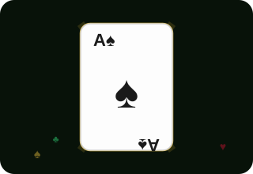

<p align="center">
  
</p>

# Solitaire

<p align="center">
  <a href="README.md"></a>
  <a href="README.es.md"></a>
  <a href="README.fr.md"></a>
  <a href="README.de.md"></a>
  <a href="README.pt-BR.md"></a>
  <a href="README.zh-CN.md"></a>
  <a href="README.ja.md"></a>
  <a href="README.ko.md"></a>
  <a href="README.it.md"></a>
  <a href="README.ar.md"></a>
</p>

<p align="center">
  
</p>

<p align="center">
  <a href="https://dacameragirl.github.io/Solitaire/"></a>
  
  
  
</p>

**Le solitaire Klondike classique, directement dans votre navigateur.**
Glissez-déposez les cartes, choisissez un style de jeu de cartes, une couleur de
table, tentez une mission de défi, et jouez avec musique et son. Aucune
installation, aucune compilation, aucune dépendance — juste du HTML, du CSS et
du JavaScript pur.

En direct : [dacameragirl.github.io/Solitaire](https://dacameragirl.github.io/Solitaire/)

---

## Fonctionnalités

| Fonctionnalité | Ce qu'elle fait |
|---|---|
| **Vrai glisser-déposer** | Prenez une carte et déposez-la là où elle va, sans double clic |
| **Fondation automatique** | Un simple clic sur une carte l'envoie directement à sa fondation s'il y a une place valide, par exemple un As y va tout seul |
| **4 styles de jeu de cartes** | Classique, Royal (ivoire/serif/filigrane doré), Minimaliste et Néon — votre choix est mémorisé |
| **5 couleurs de table** | Feutre vert, Violet, Marine, Bordeaux, Anthracite — également mémorisées |
| **Missions de défi** | Course rapide (gagner en moins de 60 coups), Sans repioche (ne jamais recycler la défausse), Ruée vers les As (les 4 As rentrés avant le coup 15) |
| **Musique et son** | Une bande sonore d'ambiance en boucle activable, plus des effets sonores pour piocher, poser une carte, un coup invalide et gagner |
| **Célébration de victoire** | Une explosion de confettis et une fanfare quand le plateau est terminé |

## Comment jouer

- Faites glisser une carte et déposez-la sur une fondation ou une autre colonne
  du tableau pour la déplacer.
- Un simple clic (sans glisser) sur une carte l'envoie directement à sa
  fondation automatiquement, s'il y a une place légale — c'est le moyen rapide
  de dégager les As et les petites cartes.
- Les cartes vont sur une fondation dans l'ordre croissant par couleur, en
  commençant par l'As.
- Les cartes se déplacent vers une autre colonne sur une carte de couleur
  opposée d'un rang supérieur (ou sur une colonne vide avec un Roi).
- Cliquez sur la pioche pour tirer une carte vers la défausse ; cliquez à
  nouveau une fois vide pour recycler la défausse dans la pioche.
- Gagnez en déplaçant les 52 cartes vers les quatre fondations.

## Exécuter en local

Aucune installation nécessaire — ouvrez `index.html` directement dans un
navigateur, ou servez le dossier avec n'importe quel serveur de fichiers
statique :

```bash
python -m http.server 8000
```

Puis visitez `http://localhost:8000`.

## Déploiement

GitHub Pages sert ce dépôt directement depuis la racine de la branche `main` —
aucune compilation, donc chaque push sur `main` est publié automatiquement.

## Contributeurs

- Angela — direction produit, tests
- Claude — implémentation et workflow GitHub

## Mentions légales

Tout fonctionne entièrement dans votre navigateur. Aucun compte, aucune
collecte de données, aucun serveur — l'état de votre partie vit uniquement
dans la page et, pour vos préférences de jeu de cartes/table, dans le
stockage local de votre navigateur.
